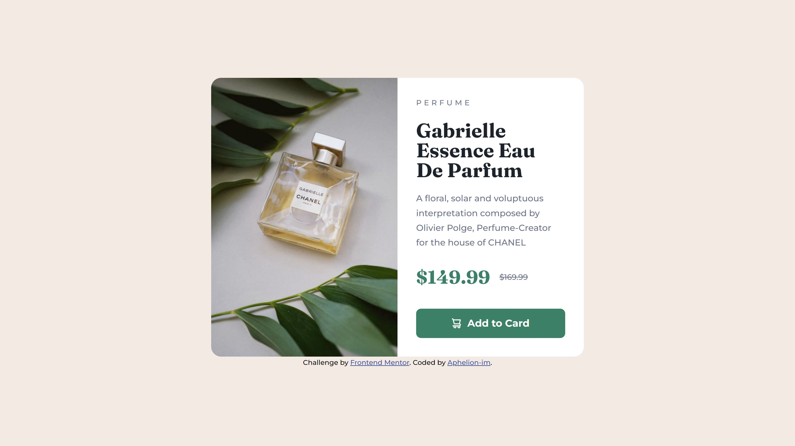

# Frontend Mentor - Product preview card component solution

This is a solution to the [Product preview card component challenge on Frontend Mentor](https://www.frontendmentor.io/challenges/product-preview-card-component-GO7UmttRfa). Frontend Mentor challenges help you improve your coding skills by building realistic projects. 

## Table of contents

- [Overview](#overview)
  - [The challenge](#the-challenge)
  - [Screenshot](#screenshot)
  - [Links](#links)
- [My process](#my-process)
  - [Built with](#built-with)
  - [What I learned](#what-i-learned)
  - [Continued development](#continued-development)
  - [Useful resources](#useful-resources)
- [Author](#author)


## Overview

### The challenge

Users should be able to:

- View the optimal layout depending on their device's screen size
- See hover and focus states for interactive elements

### Screenshot



### Links

- Solution URL: [Add solution URL here](https://your-solution-url.com)
- Live Site URL: [Add live site URL here](https://your-live-site-url.com)

## My process

### Built with

- Semantic HTML5 markup
- Sass
- Flexbox
- Mobile-first workflow
- ViteJS

### What I learned
- The shopping-cart icon only appeared when using `display: inline-flex`. I will have to study this further.
- The `<picture>` HTML element and the possibility to enter media queries. See code below.
- Josh Comeau's CSS reset. [Josh Comeau's CSS reset](https://www.joshwcomeau.com/css/custom-css-reset/)
- To start CSS/Sass color variables with: clr- 
- To start CSS/Sass font-family with: ff-
- To start CSS/Sass font-weight with: fw-
- To use a custom data-* attribute to place an svg as an icon. See code below.

```html
<picture>
    <source srcset="./assets/images/image-product-desktop.jpg" media="(min-width: 600px)">
    
</picture>
```

```html
<button type="button" data-icon="shopping-cart">Add to Card</button>
```

### Continued development
Code-wise I am not entirely satisfied.

CSS writing style may be improved with the [BEM method](https://getbem.com/introduction/). 

### Useful resources

- [Kevin Powell: Taking on a Frontend Mentor challenge | Responsive Product Preview Card Component](https://www.youtube.com/watch?v=B2WL6KkqhLQ) - Kevin Powell's take on this project
- [Kevin Powell's Github repo of this specific project](https://github.com/kevin-powell/product-preview-card-component-main) - Sometimes studied this repo to get some inspiration
- [Firefox developer edition](https://www.mozilla.org/nl/firefox/developer/) - Kevin Powell uses this browser during the project. 
- [Josh Comeau's CSS reset](https://www.joshwcomeau.com/css/custom-css-reset/)
 
## Author

- Frontend Mentor - [@Aphelion-im](https://www.frontendmentor.io/profile/Aphelion-im)


